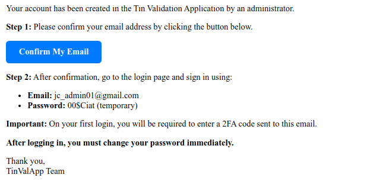
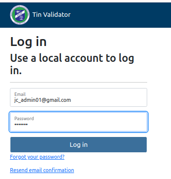
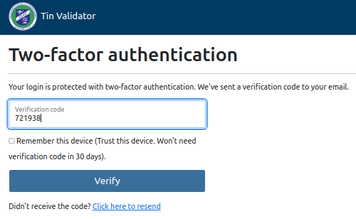
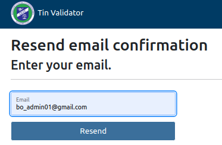

# Web Portal Access Guide (Role: USER, CIAT_ADMIN, AT_ADMIN)

Previous Guides: General Guide

## First Login

Once your user account has been created, you will receive an email with the information and steps to follow.
If you do not receive it or cannot find it, you can request it to be resent.

## Login

*Purpose*: Access the system.

### Steps

Click to confirm your email "Confirm My Email" and continue.

Enter email and temporary password.

Immediately, an access code will be sent to your email address, showing this message.

You will find your access code in your email.

Enter the verification code and, if desired, check the "Trust this Machine" option.

Login request with email resend option.

## Two-Factor Authentication (2FA)

Provides greater security to the system by sending an access code to the user's email address immediately. The code is valid for 10 minutes.

## Mark to Trust this Device

Allows the user to inform the system that when logging in from the current device, the two-factor authentication code will not be required for 30 days.
