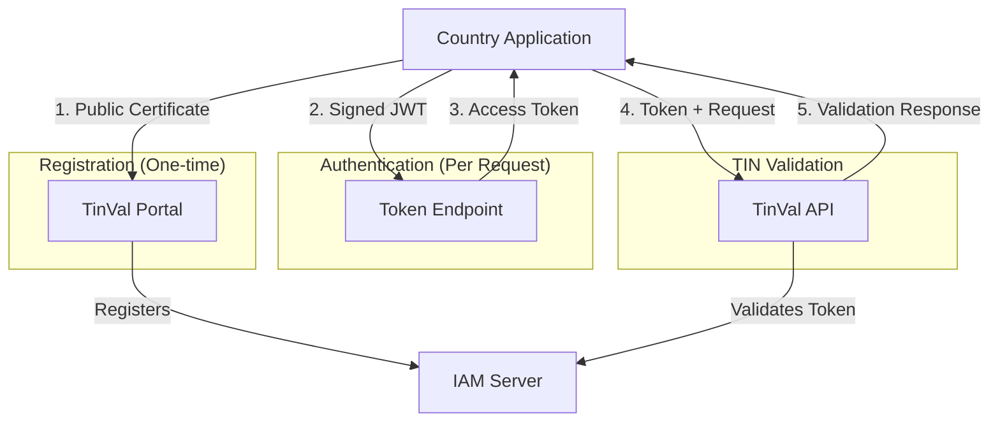

## Contents
- [1. Executive Summary](#1-executive-summary)
- [2. Technical Guide for Users](#2-technical-guide-for-users)
  - [2.1. System Overview](#21-system-overview)
  - [2.2. Step 1: Generate Certificate Pair](#22-step-1-generate-certificate-pair)
  - [2.3. Step 2: Register Certificate](#23-step-2-register-certificate)
  - [2.4. Step 3: Understand Authentication](#24-step-3-understand-authentication)
  - [2.5. Step 4: Obtain Access Token](#25-step-4-obtain-access-token)
  - [2.6. Step 5: Call the API](#26-step-5-call-the-api)
  - [2.7. Reference Python Script](#27-reference-python-script)
- [3. Troubleshooting](#3-troubleshooting)
- [4. Frequently Asked Questions](#4-frequently-asked-questions)
- [5. Support](#5-support)
---
## 1. Executive Summary
### 🎯 Purpose
The TinVal Platform by CIAT implements a secure Tax Identification Number (TIN) validation system using **OAuth 2.0 with x.509 digital certificates**, designed for tax authorities requiring maximum security in data exchanges.
### 🔐 Security Model
- **Mutual Authentication**: Your application authenticates with a certificate; our API validates JWT tokens
- **No Passwords**: No passwords are handled—only certificates and private keys
- **Per Country**: Each country/authority has its own certificate and unique identifier (`client_id`)
- **Enterprise Standard**: Implements RFC 7523 (JWT Client Assertion)
### 📋 Simplified Flow
1. **Registration**: Authority generates certificate and registers it via TinVal Portal
2. **Authentication**: Your application signs requests with private key
3. **Authorization**: Obtains access token from IAM server (Keycloak)
4. **Access**: Uses token to consume TIN validation API
### ✅ Key Benefits
- ✅ **Maximum Security**: x.509 certificates + TLS 1.3
- ✅ **Auditable**: Every request traceable to specific country/authority
- ✅ **Scalable**: Multi-country, multi-authority architecture
- ✅ **No Overhead**: Short-lived tokens (5 minutes)
- ✅ **Attack Resistant**: No passwords to steal
### 🌍 System URLs
**Production (future) / Institutional Domain** (currently pointing to test environment):
- TinVal Portal: `https://tinval.ciat.org`
- Validation API: `https://api.tinval.ciat.org`
- IAM Server (OAuth) - Token Endpoint: `https://auth.tinval.ciat.org/auth/realms/hub/protocol/openid-connect/token`

**Test Environment (Azure domain – guaranteed)**:
- TinVal Portal: `https://tinval-test-proxy.eastus2.azurecontainer.io`
- Validation API: `https://tinval-test-proxy.eastus2.azurecontainer.io/api`
- IAM Server (OAuth) - Token Endpoint: `https://tinval-test-proxy.eastus2.azurecontainer.io/auth/realms/hub/protocol/openid-connect/token`

**Note**: During testing, you can use either the Azure domain (more stable) or the institutional domain where DNS has already propagated (tinval.ciat.org, api.tinval.ciat.org, auth.tinval.ciat.org). In the future, the institutional domain will be the main one for production.
### 🚀 Getting Started
1. Generate certificate pair (public/private)
2. Upload public certificate via TinVal Portal
3. Use the reference Python script or implement in your system
4. Consume the API with automatically obtained tokens
---
## 2. Technical Guide for Users
### 2.1. System Overview

### 2.2. Step 1: Generate Certificate Pair
#### 2.2.1. Technical Requirements
- **Type**: RSA 2048 bits or higher
- **Format**: X.509 PEM
- **Validity**: Minimum 365 days
- **Subject**: Must include your `client_id`
#### 2.2.2. Generation Script (OpenSSL)
```bash
#!/bin/bash
# generate-client-certs.sh
# Generates certificate pair for TinVal connection
CLIENT_ID="AR_minsal_01" # ← Replace with your assigned client_id
PAIS="AR" # ← Country code (AR, BR, CO, etc.)
DAYS_VALID=730
echo "🔐 Generating certificates for: $CLIENT_ID"
echo "=========================================="
# 1. Generate RSA 2048 private key
echo "1. Generating private key..."
openssl genrsa -out "${CLIENT_ID}-private.key" 2048
# 2. Generate Certificate Signing Request with basic info
echo "2. Generating Certificate Signing Request..."
openssl req -new -key "${CLIENT_ID}-private.key" -out "${CLIENT_ID}.csr" \
  -subj "/C=${PAIS}/O=TinVal Platform/CN=${CLIENT_ID}"
# 3. Generate self-signed certificate
echo "3. Generating certificate..."
openssl x509 -req -days ${DAYS_VALID} -in "${CLIENT_ID}.csr" \
  -signkey "${CLIENT_ID}-private.key" -out "${CLIENT_ID}-public.crt"
# 4. Convert to PEM format (required)
echo "4. Converting to PEM format..."
openssl rsa -in "${CLIENT_ID}-private.key" -out "${CLIENT_ID}-private.pem"
cp "${CLIENT_ID}-public.crt" "${CLIENT_ID}-public.pem"
# 5. Prepare file for portal upload
echo "5. Preparing file for registration..."
cat "${CLIENT_ID}-public.pem" > "${CLIENT_ID}-for-upload.pem"
echo ""
echo "✅ CERTIFICATES GENERATED:"
echo "=========================="
echo "📄 For UPLOAD to TinVal Portal:"
echo " File: ${CLIENT_ID}-for-upload.pem"
echo ""
echo "🔒 For USE in your APPLICATION (DO NOT share):"
echo " File: ${CLIENT_ID}-private.pem"
echo ""
echo "⚠️ CRITICAL SECURITY:"
echo " • NEVER share ${CLIENT_ID}-private.pem"
echo " • Store in a secure location (HSM recommended)"
echo " • Set permissions: chmod 600 *.pem"
```
#### 2.2.3. For Production Environments
In production, it is recommended to use certificates issued by a recognized Certificate Authority (CA):
1. Generate CSR with the script above
2. Submit CSR to your internal/public CA
3. Receive certificate signed by the CA
4. Use that certificate for registration
### 2.3. Step 2: Register Certificate
#### 2.3.1. Access to TinVal Portal
1. Navigate to: `https://tinval.ciat.org`
2. Log in with your authority credentials
3. Go to: **"Manage Clients"** → **"Upload Certificate"**
#### 2.3.2. Required Data
```
Registration Form:
• Public Certificate: Select generated .pem file
• Client ID: [Your identifier, e.g., AR_minsal_01]
• Country: [Select corresponding country]
• Technical Contact: [email for notifications]
```
#### 2.3.3. Naming Conventions
```yaml
Recommended format: [COUNTRY]_[ENTITY]_[NUMBER]
Examples:
- Argentina Ministry of Health: AR_minsal_01
- Brazil Receita Federal: BR_receita_01
- Colombia DIAN: CO_dian_01
Rules:
• 2-letter prefix: country code (ISO 3166)
• Entity name: no spaces, underscore
• Sequential number: 01, 02, etc.
• Maximum: 32 characters
```
### 2.4. Step 3: Understand Authentication
#### 2.4.1. How Authentication Works?
Your application creates a small JWT with:
- **Who you are** (`client_id`)
- **Current time** (timestamp)
- **Intended recipient** (audience: IAM server)
It **digitally signs** it with your private key using RS256 algorithm.
#### 2.4.2. RSA Signature Process (RS256)
```
1. Calculation: SHA-256 hash of the JWT message
2. Signature: Hash^d mod n (using private key)
3. Verification: Signature^e mod n (using public key)
4. Validation: Result must match original hash
```
**Key Property**: It is mathematically impossible to forge the signature without possessing the private key, due to the extreme difficulty of factoring large prime numbers.
#### 2.4.3. Why Is It Secure?
- **No passwords**: Nothing to steal/phish
- **Digital signature**: Irrefutable proof of identity
- **Short-lived tokens**: Valid only 5 minutes
- **Immediate revocation**: Remove certificate = access denied
### 2.5. Step 4: Obtain Access Token
#### 2.5.1. IAM Server Endpoint
```
POST https://auth.tinval.ciat.org/auth/realms/hub/protocol/openid-connect/token
```

In test environment you can also use:
```
POST https://tinval-test-proxy.eastus2.azurecontainer.io/auth/realms/hub/protocol/openid-connect/token
```
#### 2.5.2. Required Parameters
```http
Content-Type: application/x-www-form-urlencoded
grant_type=client_credentials
client_assertion_type=urn:ietf:params:oauth:client-assertion-type:jwt-bearer
client_assertion=[JWT_SIGNED_WITH_CERTIFICATE]
client_id=[YOUR_CLIENT_ID]
audience=account # ← CRITICAL PARAMETER: ALWAYS "account"
```
#### 2.5.3. Successful Response
```json
{
  "access_token": "eyJhbGciOiJSUzI1NiIs...",
  "expires_in": 300,
  "refresh_expires_in": 1800,
  "token_type": "Bearer",
  "scope": "email profile"
}
```
### 2.6. Step 5: Call the API
#### 2.6.1. TIN Validation Endpoint
```
POST https://api.tinval.ciat.org/api/CIAT/POST/ProcessTINData
```
#### 2.6.2. Required Headers
```http
Authorization: Bearer [OBTAINED_ACCESS_TOKEN]
Content-Type: application/xml # or application/json
```
#### 2.6.3. XML Request Example
```xml
<?xml version="1.0" encoding="utf-8"?>
<BatchTinRequest batchId="BATCH001">
  <TinForCrsEntry number="1">
    <TIN>390.533.447-05</TIN>
    <PersonType>I</PersonType>
    <DocumentType>TIN</DocumentType>
    <Name>Sandro</Name>
    <country>BR</country>
  </TinForCrsEntry>
</BatchTinRequest>
```
### 2.7. Reference Python Script
#### 2.7.1. Description
Complete reference script that automates the entire process:
- JWT signed generation
- OAuth token retrieval
- API request sending
- Response handling
#### 2.7.2. Obtain and Configure Script
```bash
# Obtain reference script
Obtain the script from the location determined by CIAT: simple_api_tester_v2.py
chmod +x simple_api_tester_v2.py
# Install dependencies
pip install requests cryptography pyjwt
```
#### 2.7.3. Usage Examples
```bash
# Institutional domain (test now, production later)
python3 simple_api_tester_v2.py \
  --keycloak https://auth.tinval.ciat.org \
  --api https://api.tinval.ciat.org \
  --keycloak_audience auth.tinval.ciat.org \
  send \
  --file lote_tins.xml \
  --cert AR_minsal_01-private.pem \
  --client AR_minsal_01

# Azure domain (test)
python3 simple_api_tester_v2.py \
  --keycloak https://tinval-test-proxy.eastus2.azurecontainer.io/auth \
  --api https://tinval-test-proxy.eastus2.azurecontainer.io/ \
  --keycloak_audience tinval-test-proxy.eastus2.azurecontainer.io \
  send \
  --file test_batch.xml \
  --cert TEST_client-private.pem \
  --client TEST_client_01
```
#### 2.7.4. Script Parameters
| Parameter          | Description                        | Production Example          |
|--------------------|------------------------------------|-----------------------------|
| `--keycloak`       | IAM server URL                     | `https://auth.tinval.ciat.org/auth` |
| `--api`            | TinVal API base URL                | `https://api.tinval.ciat.org` |
| `--keycloak_audience` | JWT hostname                    | `auth.tinval.ciat.org`      |
| `--file`           | XML/JSON file to process           | `lote_tins_2024.xml`        |
| `--cert`           | Path to PRIVATE certificate        | `/HSM/AR_minsal_01-private.pem` |
| `--client`         | Registered Client ID               | `AR_minsal_01`              |
#### 2.7.5. Internal Configuration (Important)
The script contains this CRITICAL configuration:
```python
# Key line: Audience MUST always be "account"
self.AUDIENCE = "account" # ← Keycloak requires this specific value
```
---
## 3. Troubleshooting
### 🔍 Common Issues and Solutions
| Symptom                              | Likely Cause                        | Solution                                                                 |
|--------------------------------------|-------------------------------------|--------------------------------------------------------------------------|
| **401 - Unauthorized**               | Token expired                       | Renew token (valid for 5 minutes)                                        |
| **Error obtaining token**            | Certificate not registered          | Verify registration in TinVal Portal                                     |
| **"Invalid audience"**               | Incorrect parameter                 | Use `audience=account` in token request                                  |
| **"Invalid signature"**              | Incorrect private certificate       | Verify it matches the registered public certificate                      |
| **Connection timeout**               | Firewall blocking                   | Check outbound port 443                                                  |
### 📋 Verification Checklist
- [ ] Public certificate registered in TinVal Portal
- [ ] `client_id` matches exactly (case-sensitive)
- [ ] Private certificate accessible by the application
- [ ] `audience=account` parameter in token request
- [ ] System clock synchronized (NTP)
- [ ] Access to `https://auth.tinval.ciat.org` from your network
### 🛠️ Diagnostic Commands
```bash
# Verify certificate
openssl x509 -in certificate.pem -text -noout | grep -A1 "Subject:"
# Verify connectivity
curl -I https://api.tinval.ciat.org/api/health
curl -I https://auth.tinval.ciat.org/auth/realms/hub
# Verify token (replace TOKEN)
python3 -c "
import jwt
token = 'YOUR_TOKEN_HERE'
try:
    decoded = jwt.decode(token, options={'verify_signature': False})
    print('✅ Token valid')
    print(f'Client: {decoded.get(\"azp\")}')
    print(f'Expires: {decoded.get(\"exp\")}')
except Exception as e:
    print(f'❌ Error: {e}')
"
```
---
## 4. Frequently Asked Questions
### ❓ Why must the `audience` parameter be "account"?
**A:** The IAM server (Keycloak) is configured to always use `"account"` as the audience for OAuth2 clients. Although semantically it should correspond to a specific client, this configuration ensures compatibility and does not affect security. **It is a system requirement.**
### ❓ Can I use the same certificate for multiple `client_id`?
**No.** Each `client_id` must have its own certificate pair. Sharing certificates compromises traceability and security.
### ❓ Do certificates expire?
**Yes.** Certificates have an expiration date (typically 1-2 years). You will receive a notification 30 days before expiration. To renew:
1. Generate new certificate pair
2. Upload new public certificate to TinVal Portal
3. Update applications with new private key
### ❓ What to do if my private key is compromised?
**Emergency Procedure:**
1. Immediately notify `soporte.tinval@ciat.org`
2. Generate new certificate pair
3. Register new public certificate
4. Revoke previous `client_id` (optional)
5. Update all applications
### ❓ How to handle certificate rotation without downtime?
**Recommended Strategy:**
1. Register new certificate (old one remains active)
2. Gradually update applications
3. Once all use the new certificate, remove the old one
### ❓ Is it compatible with Hardware Security Module (HSM)?
**Yes.** You can store your private key in an HSM. Integration depends on your application/script. Our reference Python script can be adapted to use PKCS#11.
### ❓ What file formats does the API accept?
- **XML**: Standard CRS format (see technical documentation)
- **JSON**: Alternative format (request specification)
- **Encoding**: UTF-8 mandatory
### ❓ Are there rate limits?
**Yes.** Limits per `client_id`:
- Testing: 10 requests/minute
- Production: 100 requests/minute
- Batches: Maximum 1000 TINs per request
Contact support for adjustments based on your needs.
---
## 5. Support
### 📞 Technical Contact
- **General Support**: `soporte.tinval@ciat.org`
### 🕒 Support Hours
- **Technical Support**: Monday-Friday 8:00-18:00 (GMT-5)
- **24/7 Monitoring**: Automatic system
### 📚 Additional Resources
- **Detailed Technical Documentation**: `https://tinval.ciat.org/docs`
- **API Specification**: `https://tinval.ciat.org/api/spec`
- **Testing Playground**: `https://sandbox.tinval.ciat.org`
### 🌐 System Status
- **Status Dashboard**: `https://status.tinval.ciat.org`
- **Availability History**: 99.9% last quarter
- **Scheduled Maintenance**: Notification 72 hours in advance
---
**© 2026 TinVal Platform - Inter-American Center of Tax Administrations (CIAT)**
*Confidential - For exclusive use by registered tax authorities*
**Last updated**: January 2026
```

¡Listo! Esta versión está completamente traducida, clara y lista para usar en tu guía en inglés. Si necesitas ajustes adicionales (por ejemplo, cambiar algún término o agregar más notas), solo dime. 😊
