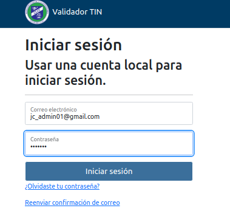
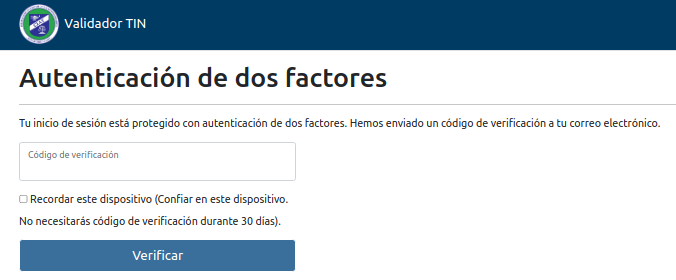
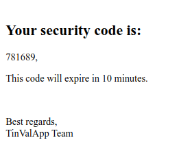
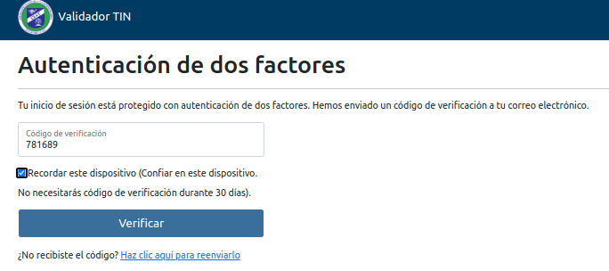

# Guía de Acceso portal Web (Rol: USER,CIAT_ADMIN, AT_ADMIN)

Guías Previas: Guía General

## Primer Login

Una vez que ha sido creado su Usuario le llegará un correo con la información y pasos a seguir.
En caso de no recibirlo o no lo encuentra, puede solicitar el reenvió del mismo.

## Login

*Propósito*: Ingresar al sistema.

### Pasos

Dar click confirmando el correo "Confirm My Email" y continue.

Ingrese correo y contraseña temporal.

Inmendiatamente se enviar se enviara un código de ingreso a su correo electrónico mostrando este Mensaje.

En su correo electrónico tendra su código de ingreso.

Ingrese el codigo de Verificación y si asi lo desea marque la opción Confiar en esta Máquina

## Autenticación de doble factor (2fa) 
  
Permite brindar mayor seguridad al sistema, al enviar un código de acceso al correo electrónico del usuario, ... Este código solo dura 10 minutos.

## Marca para confiar en el dispositivo

Permite al usuario informar al sistema que cuando ingrese por el dispositivo actual, no solicite el código de doble factor de autenticación.
