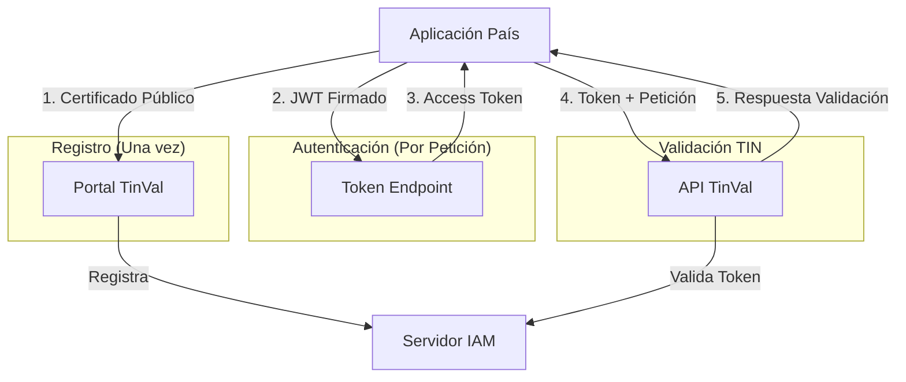

# Documentación: Autenticación API TinVal

---

## Contenidos
- [1. Resumen Ejecutivo](#1-resumen-ejecutivo)
- [2. Guía Técnica para Usuarios](#2-guía-técnica-para-usuarios)
  - [2.1. Visión General del Sistema](#21-visión-general-del-sistema)
  - [2.2. Paso 1: Generar Par de Certificados](#22-paso-1-generar-par-de-certificados)
  - [2.3. Paso 2: Registrar Certificado](#23-paso-2-registrar-certificado)
  - [2.4. Paso 3: Comprender la Autenticación](#24-paso-3-comprender-la-autenticación)
  - [2.5. Paso 4: Obtener Token de Acceso](#25-paso-4-obtener-token-de-acceso)
  - [2.6. Paso 5: Llamar a la API](#26-paso-5-llamar-a-la-api)
  - [2.7. Script Python de Referencia](#27-script-python-de-referencia)
- [3. Troubleshooting](#3-troubleshooting)
- [4. Preguntas Frecuentes](#4-preguntas-frecuentes)
- [5. Soporte](#5-soporte)

---

## 1. Resumen Ejecutivo

### 🎯 Propósito
La Plataforma TinVal de CIAT implementa un sistema de validación de TIN (Tax Identification Numbers) con autenticación segura basada en **OAuth 2.0 utilizando certificados digitales x.509**, diseñado para autoridades fiscales que requieren máxima seguridad en intercambios de datos.

### 🔐 Modelo de Seguridad
- **Autenticación Mutua**: Su aplicación se autentica con certificado, nuestra API valida tokens JWT
- **Sin Contraseñas**: No se manejan contraseñas, solo certificados y claves privadas
- **Por País**: Cada país/autoridad tiene su propio certificado y identificador único (`client_id`)
- **Estándar Empresarial**: Implementa RFC 7523 (JWT Client Assertion)

### 📋 Flujo Simplificado
1. **Registro**: Autoridad genera certificado y lo registra via Portal TinVal
2. **Autenticación**: Su aplicación firma peticiones con certificado privado
3. **Autorización**: Obtiene token de acceso del servidor IAM (Keycloak)
4. **Acceso**: Usa token para consumir API de validación TIN

### ✅ Beneficios Clave
- ✅ **Máxima Seguridad**: Certificados x.509 + TLS 1.3
- ✅ **Auditable**: Cada petición trazable a país/autoridad específica
- ✅ **Escalable**: Arquitectura multi-país, multi-autoridad
- ✅ **Sin Overhead**: Tokens de corta duración (5 minutos)
- ✅ **Resistente a Ataques**: No hay contraseñas que robar

### 🌍 URLs del Sistema
- **Portal TinVal**: `https://tinval.ciat.org`
- **API de Validación**: `https://tinval.ciat.org/api`
- **Servidor IAM (OAuth)**: `https://auth.tinval.ciat.org/auth`
- **Ambiente de Pruebas**: `https://tinval-test-proxy.eastus2.azurecontainer.io`

### 🌍 URLs del Sistema

**Producción (futuro) / Dominio institucional** (actualmente apunta al ambiente de test):
- Portal TinVal: `https://tinval.ciat.org`
- API de Validación: `https://api.tinval.ciat.org`
- Servidor IAM (OAuth) - Token Endpoint: `https://auth.tinval.ciat.org/auth/realms/hub/protocol/openid-connect/token`

**Ambiente de Pruebas (dominio azure)**:
- Portal TinVal: `https://tinval-test-proxy.eastus2.azurecontainer.io`
- API de Validación: `https://tinval-test-proxy.eastus2.azurecontainer.io/api`
- Servidor IAM (OAuth) - Token Endpoint: `https://tinval-test-proxy.eastus2.azurecontainer.io/auth/realms/hub/protocol/openid-connect/token`

**Nota**: En pruebas, puedes usar indistintamente el dominio Azure  o el dominio institucional donde el DNS ya esté propagado (tinval.ciat.org, api.tinval.ciat.org, auth.tinval.ciat.org). En el futuro, el dominio institucional será el principal para producción.

### 🚀 Para Empezar
1. Generar par de certificados (público/privado)
2. Subir certificado público via Portal TinVal
3. Usar script Python de referencia o implementar en su sistema
4. Consumir API con tokens obtenidos automáticamente

---

## 2. Guía Técnica para Usuarios

### 2.1. Visión General del Sistema



### 2.2. Paso 1: Generar Par de Certificados

#### 2.2.1. Requisitos Técnicos
- **Tipo**: RSA 2048 bits o superior
- **Formato**: X.509 PEM
- **Validez**: 365 días mínimo
- **Subject**: Debe incluir su `client_id`

#### 2.2.2. Script de Generación (OpenSSL)
```bash
#!/bin/bash
# generate-client-certs.sh
# Genera par de certificados para conexión a TinVal

CLIENT_ID="AR_minsal_01"  # ← Reemplazar con su client_id asignado
PAIS="AR"                 # ← Código país (AR, BR, CO, etc.)
DAYS_VALID=730

echo "🔐 Generando certificados para: $CLIENT_ID"
echo "=========================================="

# 1. Generar clave privada RSA 2048
echo "1. Generando clave privada..."
openssl genrsa -out "${CLIENT_ID}-private.key" 2048

# 2. Generar CSR con información básica
echo "2. Generando Certificate Signing Request..."
openssl req -new -key "${CLIENT_ID}-private.key" -out "${CLIENT_ID}.csr" \
  -subj "/C=${PAIS}/O=TinVal Platform/CN=${CLIENT_ID}"

# 3. Generar certificado auto-firmado
echo "3. Generando certificado..."
openssl x509 -req -days ${DAYS_VALID} -in "${CLIENT_ID}.csr" \
  -signkey "${CLIENT_ID}-private.key" -out "${CLIENT_ID}-public.crt"

# 4. Convertir a formato PEM (requerido)
echo "4. Convirtiendo a formato PEM..."
openssl rsa -in "${CLIENT_ID}-private.key" -out "${CLIENT_ID}-private.pem"
cp "${CLIENT_ID}-public.crt" "${CLIENT_ID}-public.pem"

# 5. Crear archivo para subir al portal
echo "5. Preparando archivo para registro..."
cat "${CLIENT_ID}-public.pem" > "${CLIENT_ID}-for-upload.pem"

echo ""
echo "✅ CERTIFICADOS GENERADOS:"
echo "=========================="
echo "📄 Para SUBIR al Portal TinVal:"
echo "   Archivo: ${CLIENT_ID}-for-upload.pem"
echo ""
echo "🔒 Para USO en su APLICACIÓN (NO compartir):"
echo "   Archivo: ${CLIENT_ID}-private.pem"
echo ""
echo "⚠️  SEGURIDAD CRÍTICA:"
echo "   • NUNCA comparta ${CLIENT_ID}-private.pem"
echo "   • Almacene en lugar seguro (HSM recomendado)"
echo "   • Configure permisos: chmod 600 *.pem"
```

#### 2.2.3. Para Entornos de Producción
En producción, se recomienda usar certificados emitidos por Autoridad Certificadora (CA) reconocida:
1. Generar CSR con el script anterior
2. Enviar CSR a su CA interna/pública
3. Recibir certificado firmado por la CA
4. Usar ese certificado para registro

### 2.3. Paso 2: Registrar Certificado

#### 2.3.1. Acceso al Portal TinVal
1. Navegue a: `https://tinval.ciat.org`
2. Inicie sesión con sus credenciales de autoridad
3. Vaya a: **"Gestionar Clientes"** → **"Subir Certificado"**

#### 2.3.2. Datos Requeridos
```
Formulario de Registro:
• Certificado Público: Seleccionar archivo .pem generado
• Client ID: [Su identificador, ej: AR_minsal_01]
• País: [Seleccionar país correspondiente]
• Contacto Técnico: [email para notificaciones]
```

#### 2.3.3. Convenciones de Nombrado
```yaml
Formato recomendado: [PAÍS]_[ENTIDAD]_[NÚMERO]
Ejemplos:
- Argentina Ministerio de Salud:     AR_minsal_01
- Brasil Receita Federal:           BR_receita_01  
- Colombia DIAN:                    CO_dian_01

Reglas:
• Prefijo de 2 letras: código país (ISO 3166)
• Nombre de entidad: sin espacios, guión bajo
• Número secuencial: 01, 02, etc.
• Máximo: 32 caracteres
```

### 2.4. Paso 3: Comprender la Autenticación

#### 2.4.1. ¿Cómo Funciona la Autenticación?
Su aplicación crea un JWT pequeño con:
- **Quién es usted** (`client_id`)
- **Hora actual** (timestamp)
- **Destinatario** (audience: servidor IAM)

Lo **firma digitalmente** con su clave privada usando algoritmo RS256.

#### 2.4.2. Proceso Matemático de Firma (RSA - RS256)
```
1. Cálculo: Hash SHA-256 del mensaje JWT
2. Firma: Hash^d mod n (usando clave privada)
3. Verificación: Firma^e mod n (usando clave pública)
4. Validación: Resultado debe coincidir con hash original
```

**Propiedad clave**: Es matemáticamente imposible falsificar la firma sin poseer la clave privada, debido a la extrema dificultad de factorizar números primos grandes.

#### 2.4.3. ¿Por qué es Seguro?
- **No hay contraseñas**: Nada que robar/phishing
- **Firma digital**: Prueba irrefutable de identidad
- **Tokens temporales**: Válidos solo 5 minutos
- **Revocación inmediata**: Remover certificado = acceso denegado

### 2.5. Paso 4: Obtener Token de Acceso

#### 2.5.1. Endpoint del Servidor IAM
```
POST https://auth.tinval.ciat.org/auth/realms/hub/protocol/openid-connect/token
```
En ambiente de pruebas también puedes usar:
```
POST https://tinval-test-proxy.eastus2.azurecontainer.io/auth/realms/hub/protocol/openid-connect/token
```

#### 2.5.2. Parámetros Requeridos
```http
Content-Type: application/x-www-form-urlencoded

grant_type=client_credentials
client_assertion_type=urn:ietf:params:oauth:client-assertion-type:jwt-bearer
client_assertion=[JWT_FIRMADO_CON_CERTIFICADO]
client_id=[SU_CLIENT_ID]
audience=account  # ← PARÁMETRO CRÍTICO: SIEMPRE "account"
```

#### 2.5.3. Respuesta Exitosa
```json
{
  "access_token": "eyJhbGciOiJSUzI1NiIs...",
  "expires_in": 300,
  "refresh_expires_in": 1800,
  "token_type": "Bearer",
  "scope": "email profile"
}
```

### 2.6. Paso 5: Llamar a la API

#### 2.6.1. Endpoint de Validación TIN
```
POST https://tinval.ciat.org/api/CIAT/POST/ProcessTINData
```

#### 2.6.2. Headers Requeridos
```http
Authorization: Bearer [ACCESS_TOKEN_OBTENIDO]
Content-Type: application/xml  # o application/json
```

#### 2.6.3. Ejemplo de Solicitud XML
```xml
<?xml version="1.0" encoding="utf-8"?>
<BatchTinRequest batchId="BATCH001">
  <TinForCrsEntry number="1">
    <TIN>390.533.447-05</TIN>
    <PersonType>I</PersonType>
    <DocumentType>TIN</DocumentType>
    <Name>Sandro</Name>
    <country>BR</country>
  </TinForCrsEntry>
</BatchTinRequest>
```

### 2.7. Script Python de Referencia

#### 2.7.1. Descripción
Script completo de referencia que automatiza todo el proceso:
- Generación de JWT firmado
- Obtención de token OAuth
- Envío de solicitudes a la API
- Manejo de respuestas

#### 2.7.2. Obtener script y Configurar
```bash
# Obtener script de referencia
Obtener el script desde donde CIAT determine: simple_api_tester_v2.py
chmod +x simple_api_tester_v2.py

# Instalar dependencias
pip install requests cryptography pyjwt
```

#### 2.7.3. Ejemplos de Uso
```bash
# (dominio Institucional- test ahora, futuro producción)
python3 simple_api_tester_v2.py \
  --keycloak https://auth.tinval.ciat.org \
  --api https://api.tinval.ciat.org \
  --keycloak_audience auth.tinval.ciat.org \
  send \
  --file lote_tins.xml \
  --cert AR_minsal_01-private.pem \
  --client AR_minsal_01

# (dominio Azure- test)
python3 simple_api_tester_v2.py \
  --keycloak https://tinval-test-proxy.eastus2.azurecontainer.io/auth \
  --api https://tinval-test-proxy.eastus2.azurecontainer.io/ \
  --keycloak_audience tinval-test-proxy.eastus2.azurecontainer.io \
  send \
  --file test_batch.xml \
  --cert TEST_client-private.pem \
  --client TEST_client_01
```

#### 2.7.4. Parámetros del Script
| Parámetro | Descripción | Ejemplo Producción |
|-----------|-------------|-------------------|
| `--keycloak` | URL del servidor IAM | `https://auth.tinval.ciat.org/auth` |
| `--api` | URL base API TinVal | `https://tinval.ciat.org` |
| `--keycloak_audience` | Hostname para JWT | `auth.tinval.ciat.org` |
| `--file` | XML/JSON a procesar | `lote_tins_2024.xml` |
| `--cert` | Ruta a certificado PRIVADO | `/HSM/AR_minsal_01-private.pem` |
| `--client` | Client ID registrado | `AR_minsal_01` |

#### 2.7.5. Configuración Interna (Importante)
El script contiene esta configuración CRÍTICA:
```python
# Línea clave: Audience SIEMPRE debe ser "account"
self.AUDIENCE = "account"  # ← Keycloak requiere este valor específico
```

---

## 3. Troubleshooting

### 🔍 Problemas Comunes y Soluciones

| Síntoma | Causa Probable | Solución |
|---------|---------------|----------|
| **Error 401 - No Autorizado** | Token expirado | Renovar token (válido 5 minutos) |
| **Error al obtener token** | Certificado no registrado | Verificar registro en Portal TinVal |
| **"Invalid audience"** | Parámetro incorrecto | Usar `audience=account` en petición |
| **"Invalid signature"** | Certificado privado incorrecto | Verificar que coincide con público registrado |
| **Timeout conexión** | Firewall bloquea | Verificar puertos 443 saliente |

### 📋 Checklist de Verificación
- [ ] Certificado público registrado en Portal TinVal
- [ ] `client_id` coincide exactamente (case-sensitive)
- [ ] Certificado privado accesible por la aplicación
- [ ] Parámetro `audience=account` en petición token
- [ ] Sistema horario sincronizado (NTP)
- [ ] Acceso a `https://auth.tinval.ciat.org` desde su red

### 🛠️ Comandos de Diagnóstico
```bash
# Verificar certificado
openssl x509 -in certificado.pem -text -noout | grep -A1 "Subject:"

# Verificar conectividad
curl -I https://tinval.ciat.org/api/health
curl -I https://auth.tinval.ciat.org/auth/realms/hub

# Verificar token (reemplazar TOKEN)
python3 -c "
import jwt
token = 'TU_TOKEN_AQUI'
try:
    decoded = jwt.decode(token, options={'verify_signature': False})
    print('✅ Token válido')
    print(f'Client: {decoded.get(\"azp\")}')
    print(f'Expira: {decoded.get(\"exp\")}')
except Exception as e:
    print(f'❌ Error: {e}')
"
```

---

## 4. Preguntas Frecuentes

### ❓ ¿Por qué el parámetro `audience` debe ser "account"?
**R:** El servidor IAM (Keycloak) está configurado para usar siempre `"account"` como audience para clientes OAuth2. Aunque semánticamente correspondería a un cliente específico, esta configuración garantiza compatibilidad y no afecta la seguridad. **Es un requerimiento del sistema.**

### ❓ ¿Puedo usar el mismo certificado para múltiples `client_id`?
**No.** Cada `client_id` debe tener su propio par de certificados. Compartir certificados compromete la trazabilidad y seguridad.

### ❓ ¿Caducan los certificados?
**Sí.** Los certificados tienen fecha de expiración (típicamente 1-2 años). Recibirá notificación 30 días antes de la expiración. Para renovar:
1. Generar nuevo par de certificados
2. Subir nuevo certificado público al Portal TinVal
3. Actualizar aplicaciones con nueva clave privada

### ❓ ¿Qué hago si comprometo mi clave privada?
**Procedimiento de emergencia:**
1. Notificar inmediatamente a `soporte.tinval@ciat.org`
2. Generar nuevo par de certificados
3. Registrar nuevo certificado público
4. Revocar `client_id` anterior (opcional)
5. Actualizar todas las aplicaciones

### ❓ ¿Cómo manejar rotación de certificados sin downtime?
**Estrategia recomendada:**
1. Registrar nuevo certificado (antiguo sigue activo)
2. Actualizar aplicaciones gradualmente
3. Una vez todas usan nuevo certificado, eliminar antiguo

### ❓ ¿Es compatible con Hardware Security Module (HSM)?
**Sí.** Puede almacenar su clave privada en HSM. La integración depende de su aplicación/script. Nuestro script Python de referencia puede adaptarse para usar PKCS#11.

### ❓ ¿Qué formatos de archivo acepta la API?
- **XML**: Formato estándar CRS (ver documentación técnica)
- **JSON**: Formato alternativo (solicitar especificación)
- **Encoding**: UTF-8 obligatorio

### ❓ ¿Límites de tasa (rate limiting)?
**Sí.** Límites por `client_id`:
- Pruebas: 10 solicitudes/minuto
- Producción: 100 solicitudes/minuto
- Lotes: Máximo 1000 TINs por solicitud

Contacte a soporte para ajustes según necesidades.

---

## 5. Soporte

### 📞 Contacto Técnico
- **Soporte General**: `soporte.tinval@ciat.org`

### 🕒 Horarios de Soporte
- **Soporte Técnico**: Lunes-Viernes 8:00-18:00 (GMT-5)
- **Monitoreo 24/7**: Sistema automático

---

**© 2026 Plataforma TinVal - Centro Interamericano de Administraciones Tributarias (CIAT)**  
*Confidencial - Para uso exclusivo de autoridades fiscales registradas*

**Última actualización**: Enero 2026  
