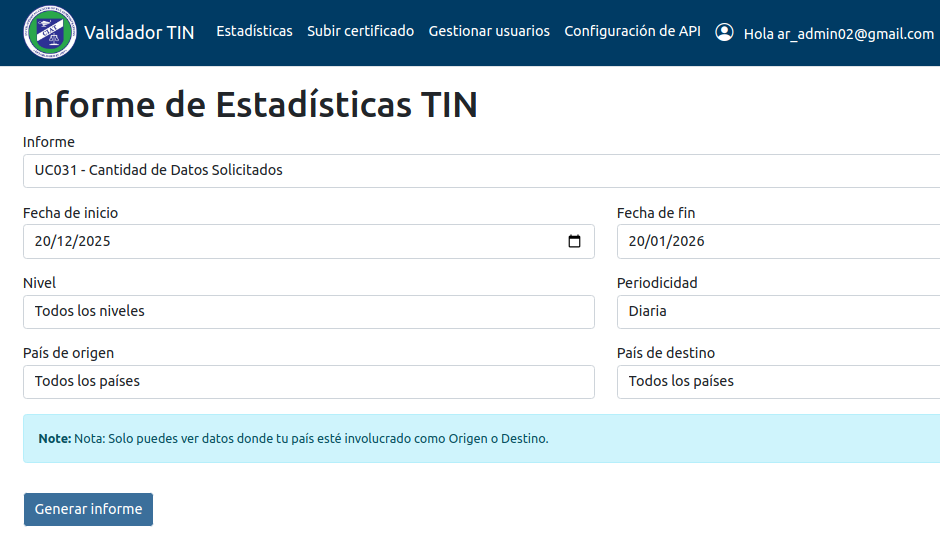
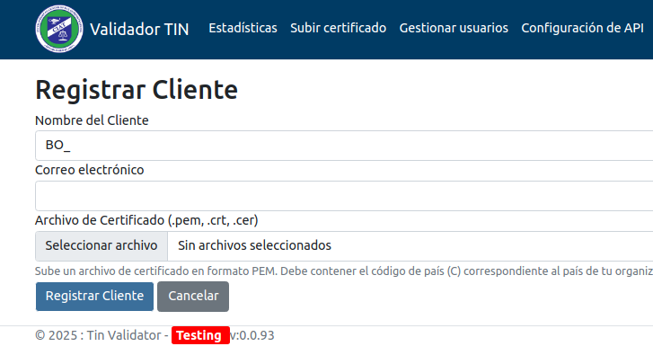
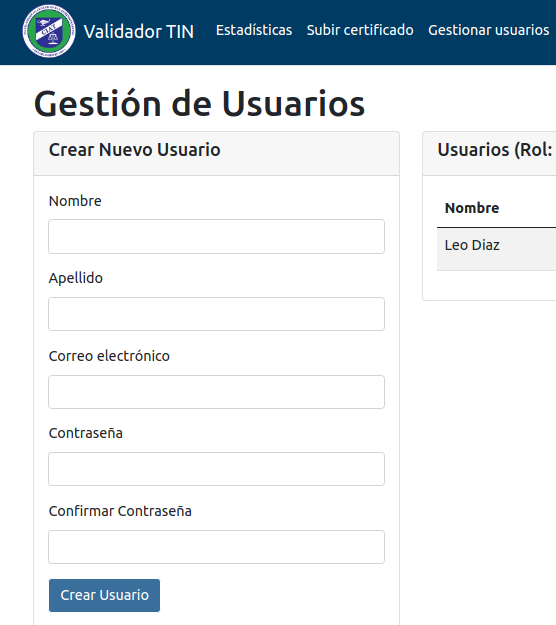
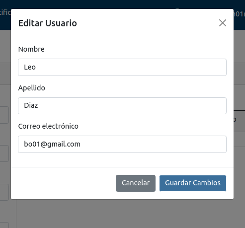
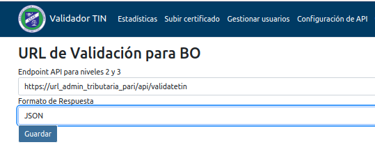
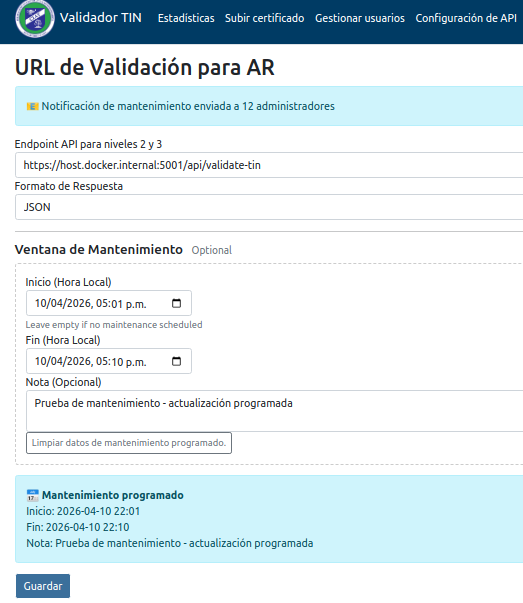
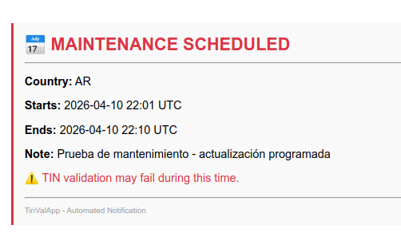

# Guía de Usuario - Administrador de Autoridad Tributaria

Sistema de Validación de TIN - CRS-CIAT

> Para usuarios autorizados únicamente.

Guias Previas: [Guía de Acceso](./access.md)

### Acceso a la Guía Técnica de Integración con la API

Para integrar tu sistema con la API de validación de TIN (autenticación con certificados x.509, obtención de tokens OAuth y llamadas a la API), consulta [Guia API](./api.md).

Esta guía incluye:
- Instrucciones paso a paso para generar y registrar certificados
- Script Python de referencia completo
- Ejemplos de llamadas a los endpoints de producción y pruebas
- Troubleshooting específico para errores comunes (401, invalid issuer, etc.)

**Importante**: Esta guía contiene detalles técnicos sensibles del flujo de autenticación. No la compartas externamente ni la publiques en sitios públicos.

## Estadísticas
Puede generar informe usando los diferentes filtros de: informe, fecha inicio, fecha fin, nivel periódo, país destino, país origen. Solo se pueden ver datos donde el país esté involucrado como Origen o Destino.

### Pasos
1. Navegar en la sección "Estadístiscas" en el menú principal.
2. Elija los diferentes filtros a su disposición.
3. Presione en "Generar Informe" se deplegara la información solicitada.
4. Puede "Descargar" el Informe.
  

## Subir Certificado
El administrador debera ingresar los datos del cliente asi como el certificado segun las especificaciones solicitadas. Tambien podra actualizar el certificado una vez creado.

### Proceso para subir certificado público:

1. Navegar a la sección "Subir Certificado" en el menú principal.
2. Ingrese el nombre del Cliente.
3. Ingrese el correo del Cliente.
4. Seleccionar el archivo `public_cert.pem`
5. Verificar que el certificado sea válido.
6. Hacer clic en "Registrar Cliente".

  

## Gestionar Usuarios
El administrador podra crear usuarios nuevos o editar los datos de los usarios ya creados. Tambien puede deshabiltar usuarios.

### Crear nuevo usuario:

1. Ir a "Gestión de Usuarios"
3. Completar la información en "Crear Nuevo Usuario" con los campos obligatorios:
   - Nombre
   - Apellido
   - Correo electrónico
   - Contraseña
   - Confirma Contraseña
4. Hacer clic en "Crear Usuario"

### Modificar usuario existente:

1. Ir a "Gestión de Usuarios"
3. Dar Click "Editar" usuario existente, ingrese la información a modificar:
   - Nombre
   - Apellido
   - Correo electrónico
  4. Hacer clic en "Guardar Cambios"
   

## Configuración de API

1. Navegar a "Configuración API"
2. Ingresar URL
3. Elegir el Formato JSON, XML, CSV
4. Guardar configuración

 ### Ventana de Mantenimiento

1. Navegar a "Configuración API"
2. Deslizar a "Ventana de Mantenimiento"
3. Elegir fecha de inicio.
4. Elegir fecha de fin.
5. Agregar Nota
6. Dar Click en "Guardar"

#### Correo del Mantenimiento Programado

El sistema enviará un correo de la programación del mantenimiento programado a todos los administradores de país registrados.  Adicionalmente agendará un correo Recordatorio de dicho mantenimiento si el inicio del mantenimiento ocurre dentro de las siguientes 24 horas.

---

*Para asistencia técnica, contacte al equipo de soporte: support.tinvalidator@ciat.org*
