# Guía de Usuario - Administrador CIAT

Sistema de Validación de TIN - CRS-CIAT

> Esta guía está destinada únicamente a usuarios autorizados.

## Estadísticas
En estadísticas nos proporciona información en tiempo real sobre el uso y rendimiento del sistema.

### Generar Reportes:
1. Navegar a "Estadísticas" 
2. Seleccionar tipo de informe (Cantidad Datos Solicitados, Cantidad de Batchs solicitados,Consultas Relaizadas o Recibidad, etc).
3. Elegir rango de fechas.
4. Elegir Nivel (L1, L2, L3).
5. Elegir Periódo.
6. Seleccionar países pais de Origen, pais de Destino o todoslos países.
7. Hacer clic en "Generar Reporte"
8. Exportar a PDF, Excel o CSV

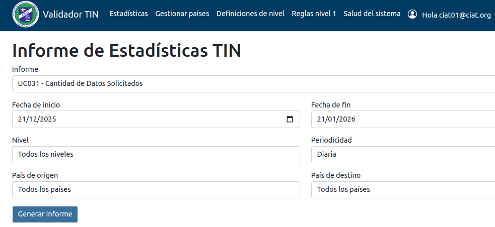

## Gestionar Países

### Agregar Nuevo País:
1. Ir a "Gestionar Países" → "Agregar Nuevo País y Usuario Administrador"
2. Seleccione un Pais:
   - Nombre del País (nombre oficial)
   - Nombre de la Autoridad Tributaria
   - Acrónimo de administración tributaria
3. Crear Usuario administrador
   - Nombre 
   - Apellido
   - Correo electronico
   - Contraseña y Confirmación
5. Hacer clic en "Enroll"

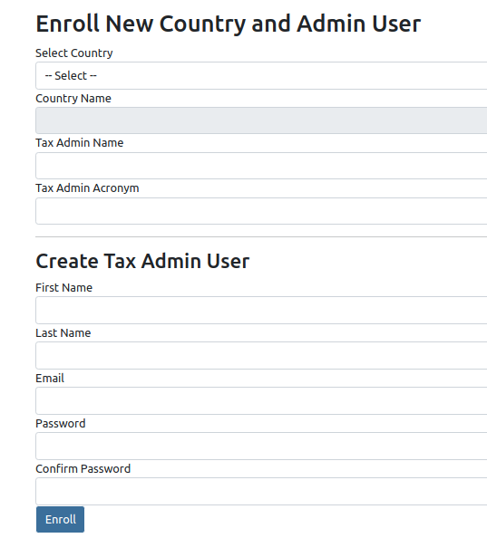

### Opciones Disponibles.

- Modificar datos de administrador.
  
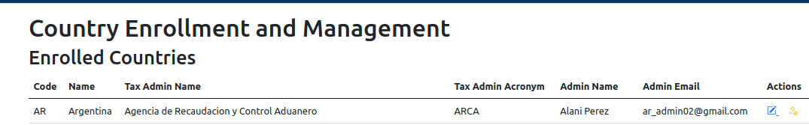

- Cambiar de Administrador eliminando el actual.

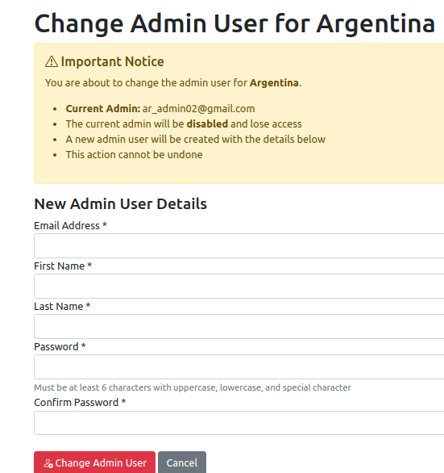

## Definiciones de Nivel por País
Las Definiciones de Nivel de Paises puede ser por:
1. Acuerdos Bilaterales: Validación directa entre dos países
2. Defecto: El país elige un nivel a ser validado
3. Mínimo: El país elige un nivel  mínimo a ser validado 

### Agregar Nueva Definición
1. Seleccionar "Add New Definition" 
2. Elegir tipo de definición
3. Seleccionar países participantes
4. Definir niveles de validación (1, 2 o 3)
6. Dar Clik en "Create"

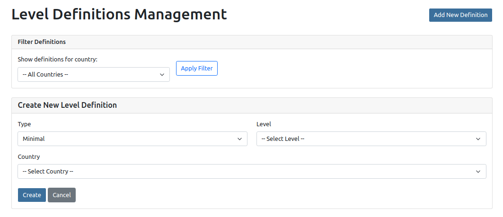
 
### Niveles de Validación:
- Nivel 1: Solo validación de formato y Dígito Verificador.
- Nivel 2: Valida la existencia del número en registro y porcentaje de coincidencia del nombre.
- Nivel 3: Validación completa con detalles del contribuyente.

## Configuración de Reglas Nivel 1
Aparecen los Países ya agregados con sus opciones para configurar reglas Nivel 1. Estas pueden ser creadas, editadas y eliminadas.

### Confifuración de Reglas:
1. Seleccione el País cuyas reglas quiere configurar
2. Dar Click "Manage Rules"
3. Dar Click "Add New Rules" y agregue Tipo de Documento, persona, Nombre.
4. Agregue las reglas JSON y Test Case con los TINs de Prueba.

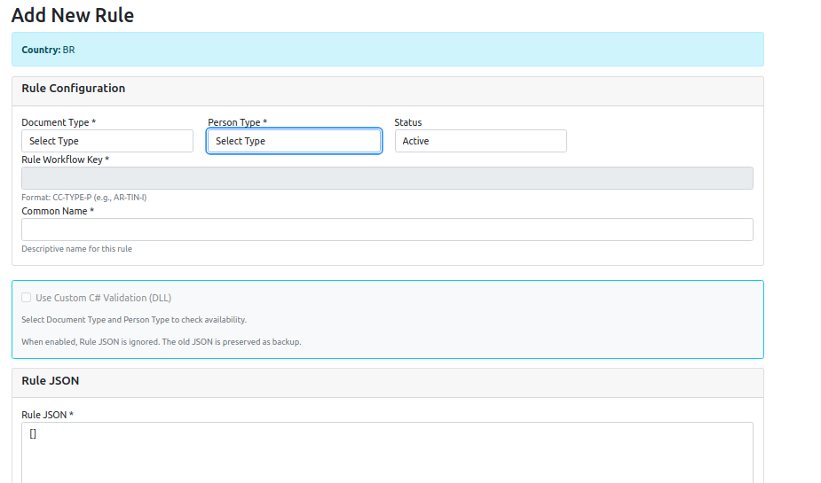

5. Pruebe la Regla dando Click "Test Rule"
6. Dar Click en "Save Rule"

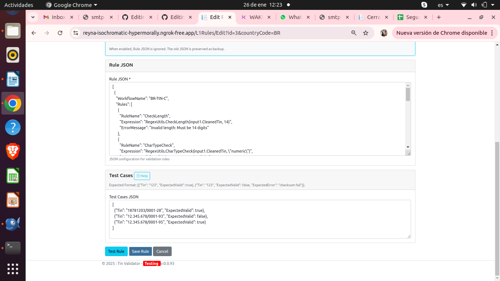

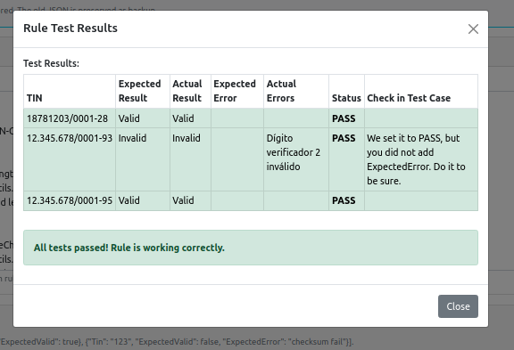

## Salud del Sistema
Monitereo del Sistema con herramientas como:

### Monitoreo de las Direcciones de los Paises:
- Direcciones Activas o no de los Paises.
Dar Click en "Verificar EndPoints", podra ver las direcciones activas o no activas, que ponen a disposición los paises para verificar L2 y L3.

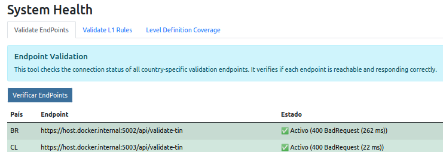

### Monitoreo de Validación de Reglas L1
Dar Click en "Verify Rules", podra ver los casos de pueba de TINs definidos de los diferentes paises con sus reglas configuradas.

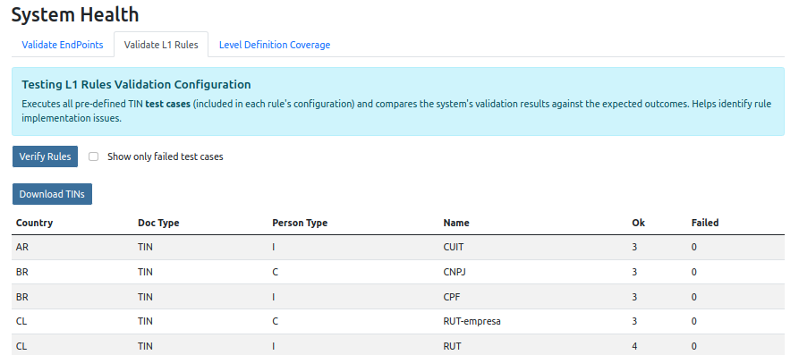

###  Monitoreo Definiciones de cobertura de Niveles:
Dar Click en "Get Coverage", podra ver los niveles definidos de los diferentes paises.

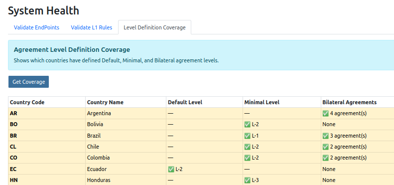

---

*Para emergencias del sistema, contacte al soporte técnico de CIAT inmediatamente: ciat.emergencia@ciat.org*
