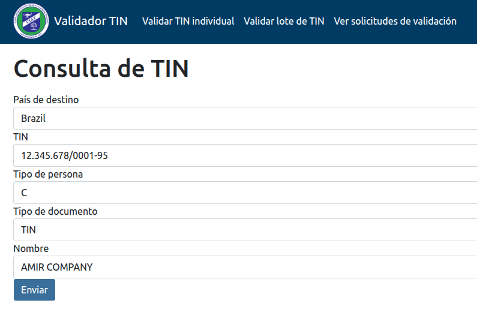

# Guía de Usuario (Rol: USER)

Guías Previas: Seguridad y Control de Acceso (Web) - TEST CAMBIO

## Validar TIN Individual

**Propósito**: Validar TINs uno por uno.

### Pasos

1. Navegar a "Validar Tin Individual"
2. Ingresar los datos solicitados:
   1. País destino
   2. Número del TIN
   3. Tipo de Persona (C= Companía, I = Individuo)
   4. Tipo de Documento (TIN, PASS= Pasaporte, NIDN=Número de Identificación Nacional)
   5. Nombre
3. Presionar "Enviar"

El sistema procesa la solicitud y devolverá un mensaje de éxito, indicando el número de solicitud asignada, con la cual puede buscarla en la opción: "Ver Resultados", normalmente aparecerá entre los primeros.

### Notas importantes

* El sistema solo permitirá seleccionar país destino si este se encuentra inscrito en el sistema.
* El sistema usará el como nivel de validación, el definido entre el país del usuario solicitante y el país destino.
* El sistema usará las reglas que encuentre basado en la combinación de País Destino, Tipo Documento, Tipo de Persona, caso contrario evaluará a TIN inválido.
* El sistema requiere que se completen todos los campos solicitados.

## Validar Lote de TINs

*(Contenido pendiente)*

## Ver resultados validaciones

*(Contenido pendiente)*
