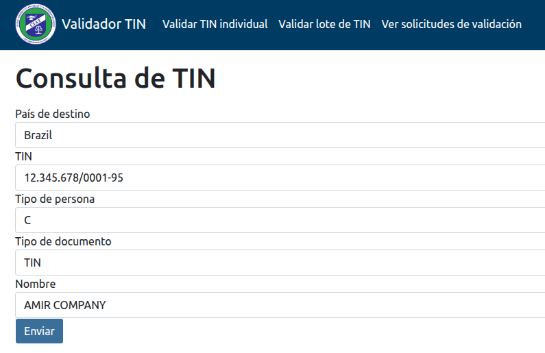
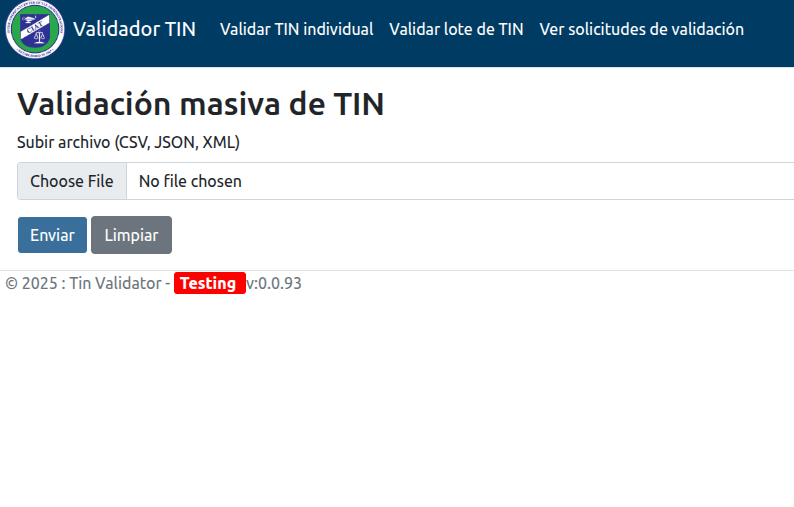
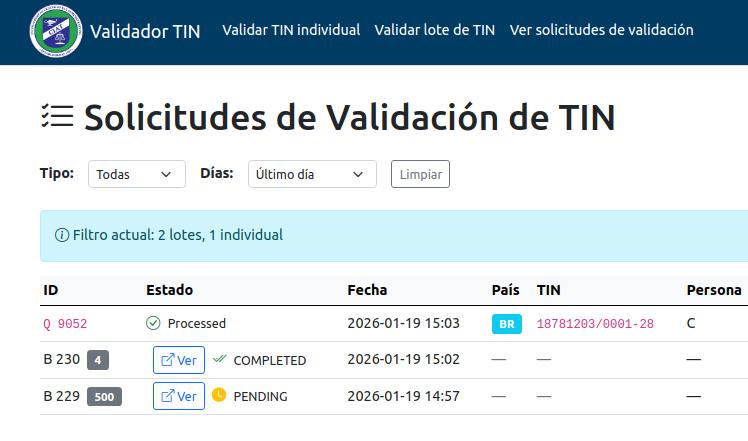
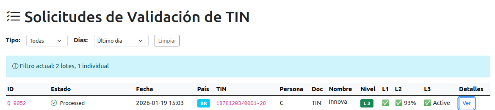
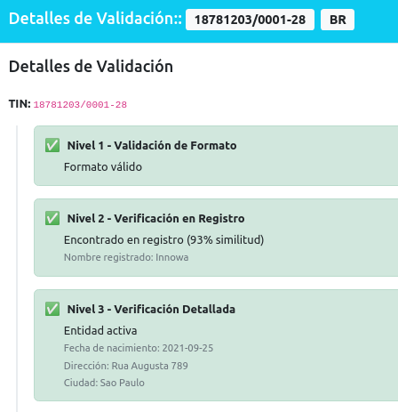
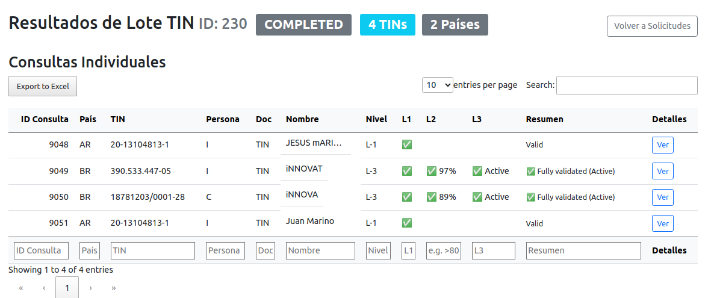
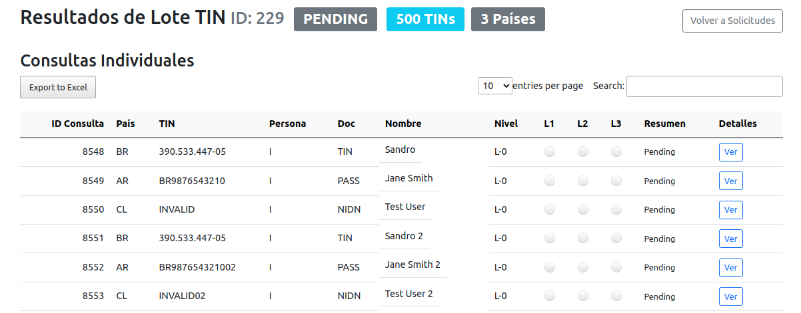

# Guía de Usuario (Rol: USER)

Guias Previas: [Guía de Acceso](./acceso.md)

## Validar TIN Individual

**Propósito**: Validar TINs uno por uno.

### Pasos

1. Navegar a "Validar Tin Individual"
2. Ingresar los datos solicitados:
   1. País destino
   2. Número del TIN
   3. Tipo de Persona (C= Companía, I = Individuo)
   4. Tipo de Documento (TIN, PASS= Pasaporte, NIDN=Número de Identificación Nacional)
   5. Nombre
3. Presionar "Enviar"

El sistema procesa la solicitud y devolverá un mensaje de éxito, indicando el número de solicitud asignada, con la cual puede buscarla en la opción: "Ver Solicitudes de Validaciones", normalmente aparecerá entre los primeros.

### Notas importantes

* El sistema solo permitirá seleccionar país destino si este se encuentra inscrito en el sistema.
* El sistema usará como nivel de validación, el definido entre el país del usuario solicitante y el país destino.
* El sistema usará las reglas que encuentre basado en la combinación de País Destino, Tipo Documento, Tipo de Persona, caso contrario evaluará a TIN inválido.
* El sistema requiere que se completen todos los campos solicitados.

## Validar Lote de TINs

**Propósito**: Validar TINs por lotes, incluidos en archivos de acuerdo a los formatos soportados (JSON, XML, CSV).

### Pasos
1. Navegar a "Validar Lote de Tin"
2. Ingresar los datos solicitados:
   1. Seleccionar el archivo con los tins.
3. Presionar "Enviar"

   

El sistema procesa la solicitud y devolverá un mensaje de éxito, indicando el número de lote asignada, con la cual puede buscarla en la opción: "Ver Solicitudes", normalmente aparecerá entre los primeros.

### Notas importantes

* El sistema solo permitirá archivos XML, JSON, CSV
* El sistema solo permitirá archivos bien estructurados, en caso contrario los rechazará informando los errores encontrados.
* El sistema solo permitirá subir archivos de máximo 1 MB de tamaño.

## Ver solicitudes de validaciones

**Propósito**: Ver el resultado de los TINs validados ya sea de manera individual y por lotes, su estado y detalles de los mismos.

### Pasos
1. Navegar a "Ver Solicitudes de Validaciones"
2. Presionar "Ver" de los diferentes Tins Validados ya sea individual o por lote.

   
El sistema mostrará el resultado de los TINs validados tanto de manera individual como por lote, indicando el número de asignado, con la cual puede ver detalles del resultado en la opción: "Ver", normalmente aparecerá en orden de fecha de solictudes.

### Ver Detalle de Validación Individual
1. Navegar a "Ver Solicitudes de Validación"
2. En la lista puede observar la validación Individual segun del número de validación asignado.
3. Presionar "Ver" mostrara Detalles del TIN validado

### Ver Detalle de Validación de Lote Completado
1. Navegar a "Ver Solicitudes de Validación"
2. En la lista puede observar segun del número de lote de validación asignado y su estado Completado.
3. Presionar "Ver" mostrara Detalles del Lote validado.
4. Podra ver la lista de los TINs cada uno con la opción "Ver" para detalles de cada uno.
5. Puede exportar la información en formato excel.
6. Puede elegir la cantidad de TINs a ser mostrados por página.
7. Tiene la opcion de "Search" para busqueda general
8. Se muestra un filtro con varias opciones de búsqueda accesible para opciones mas específicas.
   

### Ver Detalle de Validación de Lote Pendiente
1. Navegar a "Ver Solicitudes de Validación"
2. En la lista puede observar segun del número de lote de validación asignado y su estado Pendiente.
3. Presionar "Ver" mostrara Detalles del Lote en estado Pendiente.
4. Podra ver la lista de los TINs cada uno con su estado y una ves Procesado el Lote, tiene la opción "Ver" para detalles de cada uno.
6. Tiene la opcion de "Search" para busqueda general.
7. Se muestra un filtro con varias opciones de búsqueda accesible para opciones mas específicas..
8. Puede exportar la información en formato excel.
   

### Notas importantes

* El sistema solo permitirá ver solicitudes de validacion de los ultimos 30 dias.
* El sistema solo permitirá filtrar información para busqueda de los  TINs validados por lotes. 
